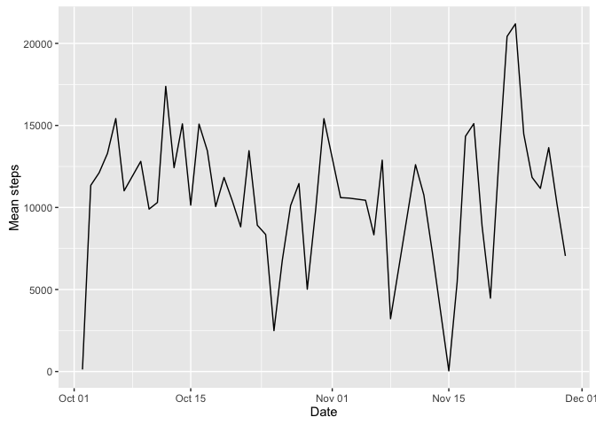

# Reproducible Research: Peer Assessment 1


## Loading and preprocessing the data


```r
data_input <- read.csv(file = unzip("activity.zip", "activity.csv"), header = TRUE)
data_input$date <- as.Date(data_input$date, "%Y-%m-%d")
# just remove the remaining NA for now
data_input <- data_input[complete.cases(data_input), ]
```


## What is mean total number of steps taken per day?


```r
totalStepsByday <- aggregate(data_input$steps, by = list(data_input$date), sum, na.rm = TRUE)
names(totalStepsByday) = c("date", "totalSteps")

meanSteps <- mean(totalStepsByday$totalSteps)
medianSteps <- median(totalStepsByday$totalSteps)

ggplot(totalStepsByday, aes(date, totalSteps, fill = months(date)))+
  geom_bar(stat="identity",position='dodge') +
  xlab("Date") + ylab("Steps")+
  geom_hline(yintercept = meanSteps, col = "green") +
  annotate("text", min(totalStepsByday$date), meanSteps-300, label = "mean") +
  geom_hline(yintercept = medianSteps, col = "blue") +
  annotate("text", min(totalStepsByday$date), medianSteps+400, label = "median")
```

<!-- -->

## What is the average daily activity pattern?

Time series plot of the average number of steps taken

```r
meanStepsBydat <- aggregate(totalStepsByday$totalSteps, by = list(totalStepsByday$date), mean)
names(meanStepsBydat) = c("date", "mean_s")
ggplot(meanStepsBydat, aes(date, mean_s)) + geom_line() + xlab("Date") + ylab("Mean steps")
```

<!-- -->


Which 5-minute interval, on average across all the days in the dataset, contains the maximum number of steps?


```r
meanStepsByinterval <- aggregate(data_input$steps, by = list(data_input$interval), mean)
names(meanStepsByinterval) = c("interval", "mean")
maxinterval <- meanStepsByinterval[which.max(meanStepsByinterval$mean),]
names(maxinterval) = c("interval", "mean")
maxinterval
```

```
##     interval     mean
## 104      835 206.1698
```

## Imputing missing values

Replace each NA with interpolated value


```r
data_input <- read.csv(file = "activity.csv", header = TRUE)
data_input$date <- as.Date(data_input$date, "%Y-%m-%d")

data_input <- data_input %>% 
  mutate( steps = na.approx(data_input$steps, method="constant", na.rm = FALSE))
```

It can be observed that after last procedure the first NA are not replaced

```r
sum(is.na(data_input$steps))
```

```
## [1] 576
```

Just remove the remaining NA

```r
data_input <- data_input[complete.cases(data_input), ]

sum(is.na(data_input$steps))
```

```
## [1] 0
```

## Are there differences in activity patterns between weekdays and weekends?

Barplot of the total number of steps taken each day after missing values are imputed

```r
totalStepsByday <- aggregate(data_input$steps, by = list(data_input$date), sum, na.rm = TRUE)
names(totalStepsByday) = c("date", "totalSteps")

ggplot(totalStepsByday, aes(date, totalSteps, fill = months(date)))+
  geom_bar(stat="identity",position='dodge') +
  xlab("Date") + ylab("Steps")
```

<!-- -->

Panel plot comparing the average number of steps taken per 5-minute interval across 

```r
isweekend <- function(x) return (wday(x) == 1 || wday(x) == 7)
data_input$weekday <- sapply(data_input$date,  isweekend)
q8 <- aggregate(steps ~ interval + weekday, data = data_input, mean)

ggplot(q8, aes(interval, steps, col = weekday)) + geom_line() + 
  xlab("Interval (in minutes)") + ylab("Average number of steps") +
  facet_grid(weekday ~.)
```

<!-- -->


